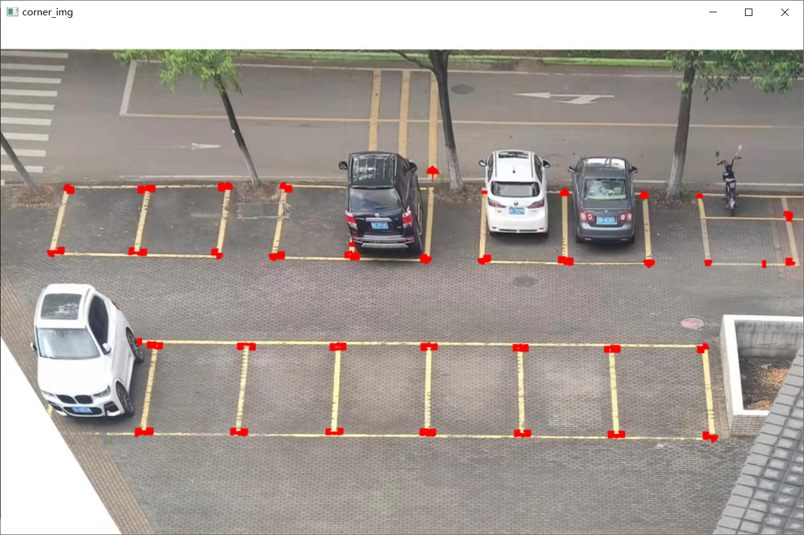

# File Description
| File Path                | Function Description                               |
| ------------------------ | -------------------------------------------------- |
| DBSCAN.py                | Module for DBSCAN density clustering algorithm    |
| hough.py                 | Implements Hough line detection algorithm          |
| qd.py                    | Image processing, including cropping, scaling, grayscale, and image saving operations |
| test_hough_del.py        | Test for removing similar Hough lines using theta and rho parameters |
| test_hough2.py           | Detect lines in an image using Hough transform     |
| test_hough1.py           | Detect lines in an image using Hough transform (alternative) |
| test_binary.py           | Test for adjusting image binarization threshold using a slider |
| test_canny.py            | Test for the Canny edge detection algorithm        |
| test_mark_intersections.py | Detect intersections of lines and mark them      |
| test_points.py           | Test for drawing Hough lines and detecting corner points |

<!-- Add code execution result images below: -->

# Code Execution Results

## 1. DBSCAN.py

## 2. hough.py

## 3. test_mark_intersections.py

## 4. test_points.py

